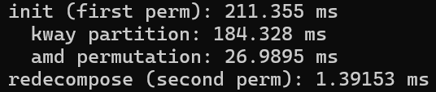

# parparth

## 环境配置
目前只支持 Ubuntu，环境配置命令为：

```bash
sudo apt update
sudo apt install -y build-essential cmake pkg-config
sudo apt install -y \
  libeigen3-dev \
  libmetis-dev \
  libsuitesparse-dev \
  libmatio-dev \
  gfortran
```

## 运行说明

### 数据生成
在 Matlab 中运行 [gen_mat](./matrices/gen_mat.m)，生成的矩阵 `matrix.mat` 和 `matrix_0.mat` 分别代表原矩阵和添加边后的矩阵。

当前数据生成参数为：$n = 10000,\ \lambda = 0.02,\ e = 2$。

### 求置换向量
在 [src](./src) 目录下运行：

```bash
./run_demo.sh
```

求得的置换向量保存在 [result](./result) 中，`perm_vec.mat` 和 `perm_vec_0.mat` 分别代表 `matrix.mat` 和 `matrix_0.mat` 的置换向量。

在当前测试数据下，取叉数 $k = 100$（可修改 [main](./src/main.cpp) 第 67 行，将 `init` 函数的第一个参数调整为 $k$），运行结果如下图所示：



### 结果可视化
在 Matlab 中运行 [draw_mat](./result/draw_mat.m) 以得到置换后矩阵稀疏模式的可视化结果。
